# DataFrameAggrSpec.jl

DataFrameAggrSpec does two things: it derives new dimensions from a DataFrame, and it aggregates
over them. Both compose — within the package, and with other packages. A "safe" parser accepts
specs from untrusted text, so a package with a text field can wire this DSL straight to it.

## Contents

- [Introduction](#introduction)
- [Dimensioning](#dimensioning)
  - [Chains: dimensions become pivot keys](#chains-dimensions-become-pivot-keys)
  - [The two dimension kinds](#the-two-dimension-kinds)
- [Aggregation](#aggregation)
  - [Composite aggregation](#composite-aggregation)
- [Pipelines](#pipelines)
- [Untrusted input: the trust boundary](#untrusted-input-the-trust-boundary)
  - [The rule, and the colon flip](#the-rule-and-the-colon-flip)
  - [Trusted Expr specs (advanced)](#trusted-expr-specs-advanced)
- [The safe grammar](#the-safe-grammar)
  - [Writing a spec](#writing-a-spec)
  - [What a host gets](#what-a-host-gets)
- [Operator reference](#operator-reference)
- [Design notes](#design-notes)

## Introduction

A UI-free **runtime** DSL for DataFrame *aggregation* and *dimensioning*. A host package can
register operators of its own.

Specs — `Symbol`s, `String`s, `Expr`s, spec objects or lambdas — compile at runtime into functions
over a `DataFrame`. [DataFramesMeta.jl](https://github.com/JuliaData/DataFramesMeta.jl)'s macros run
at compile time; these arrive from a GUI, a config file or a database and become working transforms
on the fly. The need comes from analytics. Building an intuition about a dataset means asking one
question, then the next:
- Which are the top categories by some measure — the top-scoring schools in a state?
- Which stores had the best profit margin this year? This quarter? Broken down by region? By
municipality?
- What if I redefine "profit margin"?

Each is a small change to the question. In a typical query language it is a large change to the code,
scattered over many lines. Hence the design rule: **a small change to the analysis should be a
small, local and expressive change to the code.**

Two kinds of operator, and one rule that composes them:

- **Dimensioning** — adds NEW columns, never touching existing data. Each row's value comes from
  its *sibling rows*: those sharing its partition keys (`dim"..."`, chains, `dim`).
- **Aggregation** — reduces a group of rows to one value per column
  (`aggr"..."`, `AggrHints`, `agg`).
- **Composition** — a *chain* is a pivot list declaring dimensions inline, each
  partitioned by its **left context** and at once a pivot key for what follows.
  One chain drives both verbs: `dim(df, chain)` ADDS its columns,
  `agg(df, chain)` groups by them and reduces.

<p align="center">
  
</p>

## Dimensioning

Dimensioning **adds new columns** to a DataFrame. A dimension differs from an ordinary computed
column in where its values come from: each row's value is computed from its **sibling rows**, those
sharing its grouping keys. Nothing already there is modified. Group totals, shares of a group,
running sums, "top 5" labels and quantile buckets are all dimensions.

**Why they matter**: a dimension is a natural pivot key, so defining one cheaply is how a user views
the same data through a new lens. It also answers *locally*, within a single segment — one set of
rows sharing an attribute.

Dimension specs are strings in a small spreadsheet-flavored grammar (`dim"..."`): bare identifiers
are columns, and only whitelisted operations exist, so a string is safe to take from an end user's
text field.

```julia
using DataFrameAggrSpec, DataFrames

df = DataFrame(region = ["E", "E", "W", "W", "W"],
               date   = [1, 2, 1, 2, 3],
               sales  = [10.0, 20.0, 5.0, 15.0, 30.0])

# each row's share of its region's sales
dim(df, [:region, :share => dim"sales / sum(sales)"])
#  region  date  sales  share
#  E       1     10.0   0.333…   (10 of E's 30)
#  E       2     20.0   0.667…
#  W       1      5.0   0.1      ( 5 of W's 50)
#  ...

# running total within each region, accumulated in date order. Note the "∘" usage
dim(df, [:region, :cum => dim"cumsum(sales) ∘ orderby(date)"])

# label every row by its REGION's rank on total sales ("1. W", "2. E") --
# the groups are ranked, and each member row receives its group's label
dim(df, [:rank => dim"topnames(region, sales, 2)"])

# bucket each row by which sales quantile it falls in ("1. [0%, 25%)", ...)
dim(df, [:q => dim"quantiles(sales, [.25, .5])"])

# same idea per GROUP: aggregate sales by region first, then bucket the regions
# note that we use "|>" here instead of "∘". They are equivalent in this context.
dim(df, [:rq => dim"quantiles(sales, [.5]) |> groupby(region)"])

# flag rows by a condition -- the label IS the condition, so the new column
# reads as its own definition ("sales > 12" / "Not sales > 12")
dim(df, [:big => dim"where(sales > 12)"])
```

Notice what the classifying verbs emit: not codes but **presentation-ready
labels** — `"1. W"`, `"2. [25%, 50%)"`, `"3. 1 ≤ x < 2"`, and an `"Others"`
bucket for the unranked tail. The fixed-width rank prefix is deliberate: it
makes *lexical* order the intended order, so labels sort correctly as
`CategoricalArray` levels, in a group-by and in a rendered table, with no
custom comparator. A dimension is meant to be looked at, not only grouped by.

`dim` returns a new frame; `dim!` adds the columns in place. Two postfix
**modifiers** attach engine options after the spec — intent first, options
after. `spec |> orderby(cols...)` sorts the partition before an
order-sensitive operator runs (`orderby(date => :desc)` for direction).
`spec |> groupby(keys...)` aggregates the measure to that granularity *first*,
so the verb classifies whole groups at once; the table is never reduced, and
each group's label lands on all its member rows. When both appear, `orderby`
sorts the *groups*, by keys or by their aggregates, before the verb runs —
the Pareto idiom:

```julia
# running total over REGIONS, largest region first: every row carries the
# cumulative sales of its region's "Pareto position"
dim(df, [:cum => dim"cumsum(sales) |> groupby(region) |> orderby(sales => :desc)"])
```

> **Coming from SQL window functions?** `OVER (PARTITION BY region ORDER BY
> date)` is **not** `|> groupby(region) |> orderby(date)`. That form *runs*,
> and computes something else: it sums sales per region, then cumsums the
> region totals. The window partition is the **chain's left context**:
>
> ```julia
> dim(df, [:region, :cum => dim"cumsum(sales) |> orderby(date)"])   # per-region running total
> ```
>
> `|> partitionby(...)`, `|> over(...)` and `|> within(...)` are rejected with
> this pointer, so that nobody "corrects" them to `groupby`.

Modifier order carries no meaning: `groupby |> orderby` ≡ `orderby |> groupby`.
They are options, like keyword arguments —
[design/compound-modifiers.md](design/compound-modifiers.md) explains why that
has to be true. The available operations are
listed in [docs/safe-dimension-operators.md](docs/safe-dimension-operators.md).

`groupby`'s keys may be **computed**, not just bare columns:
`dim"cumsum(sales) |> groupby(yyyymm(date))"` buckets by calendar month, and
mixes with plain columns (`groupby(region, yyyymm(date))`). The `[col, ...]`
array spelling stays plain-column-only.

**Why two spellings for the same separator?** `spec ∘ orderby(date)` and
`spec |> orderby(date)` mean the same thing, and the redundancy is deliberate.
`∘` is the truthful glyph: a modifier is not a pipeline stage the data flows
through — nothing is ever called — it *composes* with the spec, as `g ∘ f`
builds a new function without running either. It is also shorter on screen. But
specs arrive from TUI text fields and config files, where `\circ`-tab
completion does not exist and a Unicode glyph is a real barrier, so ASCII `|>`
is accepted everywhere. Whichever you type, read it as "…with this engine
option", not "pipe the data into `orderby`".

Both glyphs share one caveat: they parse with Julia's precedence — `∘` binds
as tightly as `*`, `|>` tighter than a comparison — so parenthesize a spec
whose top level is arithmetic or a comparison before attaching the modifier:
`(sales - lag(sales)) |> orderby(date)`. The unparenthesized form is caught at
parse time with the same advice.

### Chains: dimensions become pivot keys

`dim`'s second argument is always a vector. That vector is a **chain** — an
ordered pivot list. `Symbol`s name existing columns; `name => spec` declares a
new dimension. One rule makes chains compose: **a dimension is grouped by
everything to its left in the chain** (its *left context*), and once declared
it is a key for everything to its right:

```julia
chain = [:County, # existing column, County
         :top5d  => dim"topnames(District, TestScr, 5)",   # per County, rank Districts
         :District,
         :scoreq => dim"discretize(TestScr, quantiles = [.25, .5, .75])"]
                    # row-level quartile within [:County, :top5d, :District]

df2 = dim(df, chain)          # just add the columns
out = agg(df, chain; hints)   # or: group by the chain, one row per key
                              # combination, other cols reduced (hints: see below)
```

<p align="center">
  
</p>

Drop the leading `:County` and the same chain ranks districts state-wide: with
less left context, each key combination draws on a larger pool of rows.

A dimension link is also **portable**. Move it up or down the chain, or compose
it with others, and it obeys the left-context rule wherever it lands.
Composition includes feeding one classifier's output to another: dimension
labels are `CategoricalArray`s, and a classifier's name column accepts them,
stringifying as needed. To discretize first and then rank districts within each
quantile, swap the two entries. That's it.

More chain forms:

- **A chain declares pivot levels only** — every entry joins the left context
  and the key list. Side measures (shares, cumsums, z-scores) are deliberately
  *not expressible in a chain*: they would poison the grouping of
  everything to their right. Write them as **separate statements**, each
  rebuilding its context:

  ```julia
  df |> dim([:region, :share => dim"sales / sum(sales)"],
            [:region, :cum   => dim"cumsum(sales) |> orderby(date)"]
           ) |> agg([:region, :bucket => dim"quantiles(sales, [.5])"]; hints)
  ```

  The syntax forces the distinction: in a chain it is a key; in its own
  statement it is a measure.
- Chains of plain strings work for GUI and config paths:
  `["County", ["top5d", "topnames(District, TestScr, 5)"], "District"]`.

### The two dimension kinds

Every dimension evaluates in one of two ways, which decides what a column
reference binds to. The kind is inferred, or forced with
`dimspec(...; kind = ...)`; it is semantics, not a type you construct:

- **window** — a column binds to the partition's row-level subvector (sorted by
  `order` if given). The spec returns a scalar (broadcast to the partition)
  or a partition-length vector. Covers group totals, shares, z-scores,
  `cumsum`/`lag`/`lead`/`rank`. Bare specs default to this kind.
- **pivot** — classifies *groups*: within each context partition, rows are
  grouped by the dimension's `by` keys, the referenced columns are aggregated
  per group (via `AggrHints`), the spec runs over those per-group vectors, and
  each group's label is broadcast back to its member rows. Home of
  `topnames` / `quantiles` / `discretize`-over-group-sums. Classifier verbs infer
  this kind (see `registerclassifier!`); force it with `dimspec(...; kind = :pivot)`.
  An `order` (in-string `|> orderby(...)`) sorts the *groups* — by keys or
  their aggregates — before the spec runs, for cumulative and Pareto shapes.

<p align="center">
  
</p>

`dimspec(ex; by = extra_grouping_keys, order = ..., kind = :window | :pivot)`
is the full options carrier — the Julia-side equivalent of the in-string
`|> orderby(...)` / `|> groupby(...)` modifiers. Setting the same option both
ways is an error, not a precedence game. **The `by` rule**: `by` is the
grouping keys a dimension declares *itself*; a chain's left context layers on
top — unioned into the partition for a window dimension, the outer context for
a pivot one.

`order` accepts `:col`, `:col => :asc/:desc`, vectors of those, and string
forms (`":date => :desc"`). Results scatter back through the inverse
permutation, so output stays aligned with the original rows.

(`agg` ≡ materialize the chain's declared dimensions, then group by the full key
list and reduce — a pure-Symbol chain is a plain group-by.)

## Aggregation

Aggregation **reduces a group of rows to one value per column**. `agg` is the
entry point: it groups by a chain — keys existing or derived — and reduces the
remaining columns:

```julia
hints = AggrHints(:TestScr => aggr"sum(_ * EnrlTot) / sum(EnrlTot)",
                  AbstractString => aggr"uniqvalue")

agg(df, [:County]; hints)            # one row per County, all other cols reduced
agg(df, chain; hints)                # group by chain keys (existing OR computed)
```

The reductions use the same safe grammar (`aggr"..."`), with one addition:
**`_` stands for the target column**, so one spec serves many columns:

```julia
aggr"sum"                        # bare registered name ≡ sum(_)
aggr"quantile(_, 0.75)"
aggr"sum(_ * wt) / sum(wt)"      # weighted mean (wt = a weight column)
aggr"strjoinuniq(_)"             # unique values joined into a display string
```

`AggrHints` says how to aggregate each column, resolved by column name first,
then element type (by subtyping), then a default (`Real → sum`, otherwise the
single unique value). `agg` takes a **chain**, exactly like `dim`: bare symbols
are existing key columns, `name => spec` entries are dimensions materialized
before grouping. So `agg(df, [:County])` is a plain group-by, and
`agg(df, [:region, :bucket => dim"quantiles(sales, [.5])"])` groups by a
derived bucket — no separate "pivot" verb to remember.

`cols =` selects **and names** the reductions (default: every non-key column
via hints). Each entry is one output column, and the same source column may
appear repeatedly under distinct names:

```julia
agg(df, [:County]; cols = [
    :EnrlTot,                                  # hints-resolved, output :EnrlTot
    :TestScr => aggr"maximum(_)",              # inline spec, output stays :TestScr
    :TestScr => aggr"mean(_)" => :scr_avg,     # named measure
    :TestScr => aggr"std(_)"  => :scr_sd,      # ... same column again
])
```

The spec slot takes anything a hint value takes — a safe `aggr"..."` / plain
String, or a trusted Symbol / Expr / Function — and `_` binds to the source
column on the left. Output columns appear in entry order; duplicate output
names and collisions with chain keys are errors.

`allbut =` is the mirror image of `cols`: keep the default hints-driven
reduction for every non-key column *except* the listed ones (the two are
mutually exclusive, both being selection modes). It is the quickest way to
shed a helper column: `agg(df, chain; hints, allbut = [:gap])` after a
sessionization chain built from `gap`.

Selecting no measures at all — `cols = []`, or an `allbut` that excludes
every remaining column — reduces `agg` to the distinct key combinations, one
row per group, which is SQL's `SELECT DISTINCT`:

```julia
agg(df, [:region]; cols = [])   # every distinct region, no measure columns
```

### Composite aggregation

Panel data often needs **two-stage** reductions. Given population snapshots by
district over several years, "the average population" means summing the
districts *within* each year, then averaging the yearly totals; one `mean` or
`sum` over all rows computes something else. A nested `|> groupby(keys...)`
puts the first stage inside the spec:

```julia
aggr"mean(sum(_) |> groupby(year))"      # sum within each year, then average
aggr"last(sum(_) |> groupby(year))"      # the latest year's total
```

<p align="center">
  
</p>

The nested part evaluates the inner spec once per key combination and hands
the key-sorted results to the outer reduction. Keys may be computed
(`groupby(yyyy(t))`), and stages nest. 

The available reductions — and the full rules for composite aggregation — are
listed in
[docs/safe-aggregation-operators.md](docs/safe-aggregation-operators.md).

## Pipelines

`dim(chain...; hints)` and `agg(chain; hints, cols)` (no frame argument) return
reusable transforms — `cols` measure entries ride along:

```julia
report = agg([:region, :quartile => dim"discretize(sales, quantiles = [.25, .5, .75])"];
             hints = AggrHints(:sales => aggr"sum"))
df |> report                          # apply
df |> dim([:region, :z => dim"(sales - mean(sales)) / std(sales)"]) |> report
(report ∘ dim([...]))(df)             # Base ∘ composes transforms
```

## Untrusted input: the trust boundary

Every `dim"..."` and `aggr"..."` above was a **string**, and a string is the
one spec form that can arrive from an end user's text field by accident. That
is the situation this section is about, and the reason the package exists in
this shape.

Here is the rule and the *trusted* side. The untrusted side is a subsystem in
its own right, with its own section: [The safe grammar](#the-safe-grammar).

### The rule, and the colon flip

**`Expr` / `Symbol` / `Function` specs are trusted; plain `String`s are
untrusted** — parsed by the safe whitelist grammar everywhere in the API
without exception: chains, dimension constructors, `dimspec`, `AggrHints`,
`liftAggrSpecToFunc`. A String can never reach `eval`.

Trusted `Expr` specs are compiled with `Core.eval(Main, …)` so
module-qualified names (`StatsBase.mean`) resolve against your loaded
packages. The guards (must be a `:call`, no curly type-params, simple/dotted
names only, reject any `!`) make this safe for **specs you author** but are
**not a sandbox** — the sandbox is the String/untrusted path.

Trust is decided per spec and never escalates: a user-typed `dim"..."` sitting
next to a host-authored `Expr` in the same chain gains nothing from the
neighbour ([design/composition-rules.md](design/composition-rules.md), R5).

**The colon flip mnemonic** (crossing the boundary): the colon marks the
exception. In trusted Exprs everything is Julia, so *columns* need the colon
(`:( sum(:sales) )`); in untrusted strings everything is a column, so *symbol
literals* need the colon (`"discretize(x, [0], boundedness = :boundedbelow)"`).

### Trusted Expr specs (advanced)

The other side of the boundary, for package developers who need more than the
safe operators — full Julia inside a spec.

Trusted specs are `Expr`s (also bare `Symbol`s and functions — forms that
cannot arrive from a text field). Quoted symbols mark columns (`:sales`),
`:_` marks the aggregation target, and `^(:sym)` escapes a symbol from column
substitution:

```julia
using StatsBase

f = liftAggrSpecToFunc(:TestScr, :( StatsBase.mean(:_, StatsBase.Weights(:EnrlTot)) ))
Base.invokelatest(f, df)     # raw lifted functions live at a fresh world-age;
                             # agg / dim handle this internally

liftAggrSpecToFunc(:TestScr, :sum)                # bare Symbol → sum(df.TestScr)
hints = AggrHints(:TestScr => :( mean(:_, Weights(:EnrlTot)) ))
dim(df, [:region, :share => :( :sales ./ sum(:sales) )])
:( discretize(:x, [0, 1]; boundedness = ^(:boundedbelow)) )
```

Trusted and safe specs interlace freely — each chain entry is resolved
independently, so host-authored `Expr` dims compose with user-typed `dim"..."`
dims (the intended TUI pattern), and measure statements mix trust the same way:

```julia
dim(df, [:County, :top1 => dim"topnames(District, TestScr, 1)"],   # user-typed key
        [:County, :top1, :share => :( :TestScr ./ sum(:TestScr) )], # trusted measure
        [:County, :top1, :cum => dim"cumsum(EnrlTot) |> orderby(TestScr)"])
```

## The safe grammar

Strings can arrive from an end user's text field, so the untrusted path is a
**whitelist grammar with no eval anywhere**: safe to wire straight to that
field via `parseaggr(s)` / `parsedim(s)` (the string macros are compile-time
sugar for the same call). Only listed operations exist, the result is an
ordinary closure at the current world age, and re-parsing on every keystroke
is cheap.

### Writing a spec

Nearly everything follows from one rule — **a bare identifier is a column**:

```julia
dim"cumsum(sales) |> orderby(date)"                        # columns are bare words
aggr"sum(_ * wt) / sum(wt)"                                # `_` = the target column (aggr only)
dim"discretize(x, [0, 10], boundedness = :boundedbelow)"   # `:sym` = an option VALUE
```

- arithmetic and comparisons **broadcast** — no dots needed. Conditions combine
  with `&& || !` (pure, elementwise, `missing`-propagating) and bind looser than
  comparisons, so `sales > 10 && sales < 20` needs no parens.
- a top-level `∘` / `|>` attaches an engine **modifier**, `orderby(cols...)` or
  `groupby(keys...)` — metadata, never called. A *nested* `inner |> groupby(...)`
  is something else: [composite aggregation](#composite-aggregation).
- everything else is rejected: qualified names, macros, interpolation, lambdas,
  indexing, blocks, comprehensions, splats.
- one wrinkle: `missing`, `pi` and `Inf` are identifiers, hence *column
  references*, not constants. Missing-value defaults
  are literals: `coalesce(x, 0)`, never `coalesce(x, missing)`.

`listops()` shows the live vocabulary; the two [docs/](docs/) operator documents
describe every entry.

### What a host gets

**Mistakes caught at parse time, not inside a group-by** — wrong arity, an
unknown keyword, and a spec whose *shape* cannot be what it is used as
(`aggr"cumsum(_)"` returns one value per row; `dim"mean(x) |> groupby(g)"`
collapses the very groups it is meant to label).

**Errors written for the person typing**, every one held to "say what to type
instead" and quoting the spec it came from:

| You typed | It says |
|---|---|
| `maen(_)` | did you mean `mean`? — OSA repair, so transpositions are one edit |
| `avg(_)`, `nunique(x)`, `ROW_NUMBER()` | not registered here — use `mean(x)` / `countuniq(x)` / `ordinalrank(x)`. SQL, dplyr, pandas and Excel spellings are redirected by name; they are **not** aliases, so the spec still fails |
| `cumsum(:qty)` | `:qty` is a Symbol literal, only an option *value* here — a column is a bare word, without the colon |
| `cumsum(x) \|> partitionby(region)` | a window partition is the chain's **left context**, not a modifier — and pointedly *not* `groupby`, which aggregates-then-classifies |

Pass `columns = propertynames(df)` to `parseaggr`/`parsedim` and column
references get the same treatment (`checkcols` is the standalone form).

**A machine channel beside the prose.** Every rejection is a `SpecError`
carrying `code`, `token`, a drop-in `fix` and the `span` it replaces — enough
for a linter, an editor quick-fix or an agent repairing its own output, with no
regex over English. `sprint(showerror, e)` still prints exactly what a human
sees.

**Proactive suggestion**, for before and while typing: `spec_templates` proposes
whole starter specs narrowed to the frame (and guaranteed to run on it),
`spec_vocabulary` drives completion, and `specsummary` echoes back what a spec
means.

**Host-extensible** with `registerop!` / `registerclassifier!` — and because
every surface above reads the registry live, a new operator appears in
completion, repair and suggestion at once:

```julia
registerop!(:geomean, x -> exp(mean(log.(x))); shape = :reduce)   # aggr"geomean(_)"
```

`shape` is how the parser knows an operator returns one value per group, per
row, or per argument. Declaring it is optional; an operator without one gets no
shape checks rather than guessed ones.

The rest is in other documents: **[docs/extending-the-grammar.md](docs/extending-the-grammar.md)**
for writing your own operators, **[design/user-guidance.md](design/user-guidance.md)**
for the whole guidance system and its sixteen rules, and the two
operator references below.

## Operator reference

Every shipped operator — signature, kwargs, and a worked example — lives in
the operator documents, which a test keeps in sync with the registry:

- [docs/safe-dimension-operators.md](docs/safe-dimension-operators.md) —
  classifiers (`topnames`, `discretize`, `quantiles`, `where`), calendar
  buckets, order-based verbs (`cumsum`, `lag`, `lead`), the ranking quartet
  (`rank`, `denserank`, `ordinalrank`, `tiedrank`), the modifiers.
- [docs/safe-aggregation-operators.md](docs/safe-aggregation-operators.md) —
  reductions, `uniqvalue` / `countuniq` / `strjoinuniq` / `unionall`,
  `wmeanfallback`, `hhi` (Herfindahl–Hirschman concentration), and the rules
  for composite aggregation.
- [docs/extending-the-grammar.md](docs/extending-the-grammar.md) — for **host
  developers**: writing your own safe operators with `registerop!` /
  `registerclassifier!`, end to end.

`listops()` prints the live registry, including anything a host has added
with `registerop!`.

## Design notes

`design/` records the reasoning behind decisions that look arbitrary until
you hit the case that motivated them. Worth reading before filing an issue
that begins "why doesn't it just…":

- [composition-rules.md](design/composition-rules.md) — the invariants the
  package guarantees: left-context visibility, `dim` non-destructive vs `agg`
  destructive (and why `agg` decomposes exactly into `dim` + reduce, which is
  the debugging technique), trust never escalating through composition.
- [expressiveness.md](design/expressiveness.md) — why the vocabulary has the
  shape it has, and which spellings were declined (`ifelse`, `&`/`|`,
  aliases for Base names). **Read before requesting a new operator.**
- [user-guidance.md](design/user-guidance.md) — how the package gets an analyst
  to a spec that parses and means what they wanted, as one system: what the
  guidance knows (the registry, operator shape, repair), the proactive half
  (`spec_templates`/`spec_vocabulary`), the reactive half (the rejection ladder,
  did-you-mean, `checkcols`), both output channels (prose and `SpecError`), and
  the sixteen rules that keep them from contradicting each other. **Read before
  adding an error message or a template.** Ends with what a consumer — a linter,
  an LSP server, an LLM that writes specs — can build on the same machinery.
- [prior-art.md](design/prior-art.md) — how this relates to Elasticsearch
  bucket/metric aggregations, MongoDB `$setWindowFields`, Tableau LOD
  expressions, and DAX calculated columns vs measures.
- Syntax rationale: [why-two-modifier-names.md](design/why-two-modifier-names.md)
  (why `orderby`/`groupby` and not a single `by`),
  [glyph-choice.md](design/glyph-choice.md) (why `∘`/`|>` and not `.`),
  [compound-modifiers.md](design/compound-modifiers.md) (why modifier order
  carries no meaning),
  [middle-windowpivot-usecase.md](design/middle-windowpivot-usecase.md) (why
  ordered window dims may sit mid-chain).
